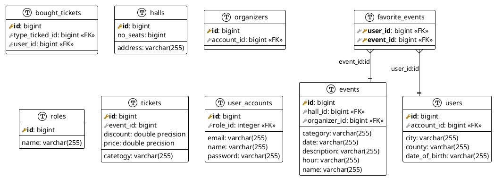

# Events Application - _name here_

Proiectul consta intr-o aplicatie care gazduieste virtual evenimetele care exista la nivel de tara. Prin intermediul aplicatiei le este adus la cunostinta utilizatorilor existenta acestor evenimente la care ei pot participa.
Aplicatia poate fi utilizata de oricine si toate evenimentele prezente in aplicatie vor fi vizibile indiferent daca utilizatorul are sau nu cont, dar detinerea unui cont aduce unele beneficii care vor fi detaliate mai jos.

Aplicatia asadar accepta trei tipuri de utilizatori:
- **Guest** - poate doar sa vada evenimentele existente in aplicatie nefiind inregistrat in aplicatie.
- **Utilizator obisnuit inregistrat** -  poate sa vada evenimentele existente in aplicatie si de asemenea sa-si rezerve un loc sau mai multe la un anumit eveniment prin cumpararea de bilete.
- **Utilizator inregistrat ca organizator** - poate sa vada evenimentele existente in aplicatie si de asemenea sa-si adauge propriul eveniment.
- **Admin** - are acces la toate informatiile despre evenimente si organizatori si mai mult decat atat adminul este cel care genereaza conturi pentru organizatori in urma unei intelegeri intre admin si organizator.

## Functionalitati
Functionalitatile sunt particularizate in functie de utilizator, dar exista si functionalitati mai generale.
Functionalitatea care le este disponibila tuturor utilizatorior este este de vizualizare a evenimentelor ce exista la momentul respectiv in aplicatie.
Urmatoarea cea mai generala functionalitate ii vizeaza pe utilizatorii care **nu sunt guest** si anume cea de autentificare in aplicatie, iar ca o extensie la functionalitatea de autentificare este resetarea parolei in cazul in care utilizatorul si-a uitat parola.

#### _Guest_
- sa se inregistreze in aplicatie.

#### _Utilizator obisnuit inregistrat_
- adaugarea unor evenimente despre care este interesat la o rubrica de Favorite.
- achizitionarea de bilete la eveniment, iar in functie de oragnizator vor putea exista mai multe tipuri de bilete.
- daca exista mai multe tipuri de bilete in functie de locul in sala, utilizatorul trebuie sa aleaga locul dintre cele disponibile, aplicatia sugerandu-i de asemenea anumite locuri care ar fi favorabile.
- in functie de evenimentele anterioare la care utilizatorul a participat, la autentificarea in aplicatie acestuia ii sunt sugerate anumite evenimente.

#### _Utilizator inregistrat ca organizator_
- adauga evenimentul pe care el il organizeaza in aplicatie avand posibilitatea de a avea tipuri diferite de bilete.
- existenta unei rubrici in care acest tip de utilizator isi poate vedea si edita evenimentele, dar si cate bilete au fost vandute pentru fiecare eveniment.

#### _Administrator_
- creeaza conturi pentru organizatori ca urmare a unei intelegeri intre cei doi.
- sterge conturi de organizatori daca intelegerea intre cei doi nu mai este valabila.
- are acces la detaliile despre organizatori si evenimente.
- poate genera anumite rapoarte.

