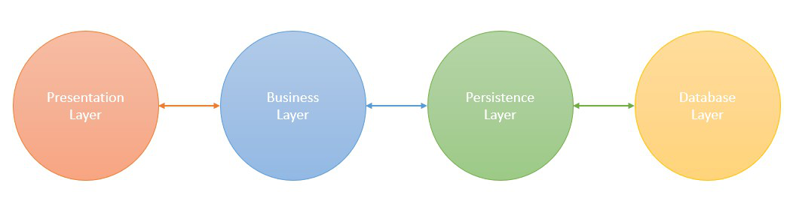
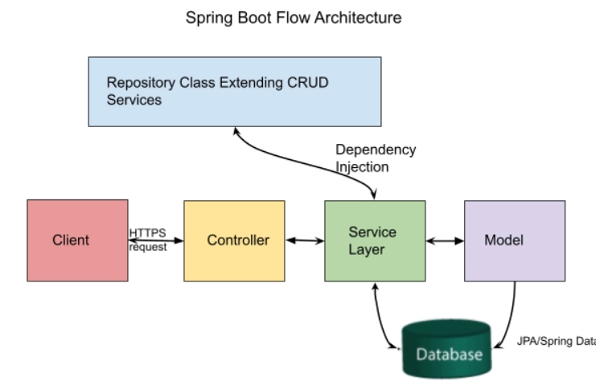

<div align="justify">

# Events Application
The project consists of an application that virtually hosts the events that exist at the country level. Through the application, users are informed of the existence of these events in which they can participate.
The application can be used by anyone and all the events present in the application will be visible regardless of whether the user has an account or not, but having an account brings some benefits that will be detailed below.


Therefore, the application accepts 4 types of users:
- **Guest** - can only see the existing events in the application without being registered in the application.
- **Standard User** -  can see the existing events in the application and also reserve one or more places at a certain event by buying tickets.
- **Organizer** - can see the existing events in the application and also add his own event.
- **Admin** - has access to all the information about events and organizers and more than that, the admin is the one who generates accounts for the organizers following an agreement between the admin and the organizer.

## Features
The features are customized according to the user, but there are also more general features.
The feature that is available to all users is to view the events that exist at that time in the application.
The next most general functionality is aimed at users who are **not guests**, namely that of authentication in the application.
#### _Guest_
- can register in application.

#### _Standard User_
- can purchase tickets to the event
- can see the tickets that he bought, to be easily found for checking tickets at the entrance of the event

#### _Organizer_
- add the event he organizes in the application 
- has a section where he can see and edit the organized events
#### _Admin_
- create accounts for the organizers as a result of an agreement between the two.
- delete organizer accounts and associated events if the agreement between the two is no longer valid.
- has access to details about organizers and events.

## Database diagram


## Architecture
The Spring Boot follows a **layered architecture** in which each layer communicates to other layers(Above or below in hierarchical order).
### Spring Boot Layers

The spring boot consists of the following four layers:
- Presentation Layer – Authentication & Json Translation
- Business Layer – Business Logic, Validation & Authorization
- Persistence Layer – Storage Logic
- Database Layer – Actual Database



#### 1. Presentation Layer

The presentation layer is the top layer of the spring boot architecture. It consists of Views. i.e., the front-end part of the application. It handles the HTTP requests and performs authentication. It is responsible for converting the JSON field’s parameter to Java Objects and vice-versa. Once it performs the authentication of the request it passes it to the next layer. i.e., the business layer.

#### 2. Business Layer

The business layer contains all the business logic. It consists of services classes. It is responsible for validation and authorization.

#### 3. Persistence Layer

The persistence layer contains all the database storage logic. It is responsible for converting business objects to the database row and vice-versa.

#### 4. Database Layer

The database layer contains all the databases such as MySql, MongoDB, etc. This layer can contain multiple databases. It is responsible for performing the CRUD operations.

### Spring Boot Flow Architecture

- The Client makes an HTTP request(GET, PUT, POST, etc.)
- The HTTP request is forwarded to the Controller. The controller maps the request. It processes the handles and calls the server logic.
- The business logic is performed in the Service layer. The spring boot performs all the logic over the data of the database which is mapped to the spring boot model class through Java Persistence Library(JPA).
- The JSP page is returned as Response from the controller.

## Implementation
### **Security**
Before starting the actual implementation, security configurations were added, in order to have a secure application. To do that, I integrated the Spring Security in my Spring Boot application, adding the security started maven dependecy, which brings in application the default security configuration. At its core, Spring Security is really just a bunch of servlet filters that help us add authentication and authorization to our web application.

#### Filter Security Chains
The first configuartion of Spring Security is Filter Security Chains.
When we send a http request to our server, it will go through a set of security filter chains. 
It defines which URL paths should be secured and which should not, allowing to access some URL only by a type of users. 

#### The UserDetailsService
This is the main configuration for our application. To load the customer details, we need to implement UserDetailsService interface. It uses spring Security UserDetailsService interface in order to lookup the username, password and Granted Authorities for any user.

#### Autentification Manager and Password Encoder
The next step was to onfigure an authentication manager with the correct password-encoding schema that will be used for credentials verification.
In my application, I choose to use the bcrypt password-hashing algorithm.

#### JSON Web Token (JWT)
The next configuration was to define a new token generator and to do this I used JWT. The generator is used at login.
We verify the provided credentials using the authentication manager, and in case of success, we generate the JWT token and return it as a response header along with the user identity information in the response body.

### **Observer Design Pattern -  Send Mails**
I used the Application Events of the Spring Framework that is an implementation of the Observer pattern for the part of the application that handles sending emails. The Observer pattern serves as a means to exchange information between loosely coupled components.

#### Application Events
The event publisher (subject) publishes an event, while the event listener (observer) only receives the specific event if the event listener listens for that specific type of event.
The application event capability of the Spring framework is synchronous by default. This implies the publisher method blocks until all registered listeners have processed the event.

My application is able to send a "welcome" mail to all users that finish successfully their registration.

#### EmailEvent Class
The EmailEvent is an application event and extends the ApplicationEvent abstract class. The EmailEvent class contains three String properties called "toEmail", "subject", "body" that store the event data.

The ApplicationEvent class is abstract since it doesn’t make sense for generic events to be published directly.

#### EmailSenderService class
The EmailSenderService is a service class that deals with sending emails to users. In its constructor are configured the application properties that enable sending emails, and it also has a method that handles the actual sending of an email. 

In the class where I want to generate a sending of an email I have an ApplicationEventPublisher object that will notify the application with an EventEmail to send mail.

``` applicationEventPublisher.publishEvent(emailEvent);```

The application that is an observer is able to listen through the annotation @EventListener() at the method that call the sendMail method from EmailSenderService.

### **Endpoints**
Controller classes handle the HTTP requests, translates the JSON parameter to object, authenticates the request and transfer it to the service layer.

#### AuthController
AuthController and AuthService handle all the requests related to authentication and registration in application.
- ```public ResponseEntity<String> register(@RequestBody StandardUserDto standardUserDto)``` - Registers a standard user and adds it to the database, while creating an account which is also saved to the database.
- ```public ResponseEntity<String> registerOrganizer(OrganizerDto organizerDto)``` - An organizer is registered in application by admin and added to the database, while creating an account which is also saved to the database.
- ```public ResponseEntity<UserAccountDto> login(UserLoginDto userLoginDto)``` - This endpoint try to authenticate a user in application. If it succeed are returned user's details.


#### UserController
UserController and UserService handle all the requests related to users, whatever if they are standard users or organizers.
- ```public ResponseEntity<String> update(StandardUserDto newUser, Long id)``` - Updates a user's data in database, if it exists. This method can update both the user account data and the personal data of a standard user.
- ```public ResponseEntity<String> updateOrganizer(OrganizerDto newOrganizer, Long id)``` - Updates an organizer's data in database, if it exists. This method can update both the user account data and the personal data of an organizer.
- ```public ResponseEntity<String> delete(Long id)``` - Deletes a standard user from the database, if it exists. This action also involves the deletion of the associated user account.
- ```public ResponseEntity<String> deleteOrganizer(Long id)``` - Deletes an organizer from the database, if it exists. This action also involves the deletion of the associated user account and only an admin is able to do this.
- ```public ResponseEntity<List<StandardUserEntity>> getAllStandardUsers()``` - Finds all standard user in database and returns them.
- ```public ResponseEntity<OrganizerDto> getOrgById(Long id)``` - Finds the organizer by id in database and returns it.
- ```public ResponseEntity<List<OrganizerDto>> getAllOrganizers()``` - Finds all organizers in database and returns them.

#### EventController
EventController and EventService handle all the requests related to events.
- ```public ResponseEntity<String> createEvent(EventDto eventDto)``` - Create an event and adds it into database. This action also involves the creation of tickets associated with the event and can be made only by organizers.
- ```public ResponseEntity<String> updateEvent(EventDto eventDto, Long id)``` - Update an event's data in database, if it exists. This action can be made only by organizers.
- ``` public ResponseEntity<String> deleteEvent(Long id)``` - Deletes an event from the database, if it exists.  This action also involves the deletion of the associated tickets. 
- ``` public ResponseEntity<List<EventEntity>> getEventsByCity(String city)``` - Finds all events from a city in database and returns them.
- ```public ResponseEntity<EventDto> getEventById(@RequestParam("eventId") Long id)``` - Finds the event with given id in database and returns them.
- ```public ResponseEntity<List<EventDto>> getEvents()``` - Finds all existing events in database and returns them.
- ``` public ResponseEntity<List<String>> getCategories()``` - Finds all event categories in database and returns them.
- ```public ResponseEntity<List<EventDto>> getEventsByOrganizer(@RequestParam("organizerId") Long id)``` - Finds all events organized by a given organizer  in database and returns them.
  
#### LocationController
LocationController and LocationService handle all the requests related to events'location.
- ```public ResponseEntity<String> createLocation(LocationDto locationDto)``` - Creates a location for an event and adds it into database, if that location does no already exist in that city.
- ``` public ResponseEntity<String> deleteLocation(Long id)``` - Deletes a location from the database, if it exists and if it is not assigned to any event.
- ```public ResponseEntity<List<LocationDto>> getLocationsByCountyAndCity(String county, String city)``` - Finds all locations from a given county and city in database and returns them.
- ```public ResponseEntity<LocationDto> getLocationById(Long id)``` - Finds location by id in database and returns them.
- ``` public ResponseEntity<List<LocationDto>> getAllLocations()``` - Finds all location in database and returns them.

A location should not be editable for security reasons. Once created, it cannot be modified to avoid any mistakes that may affect the event.

#### BoughtTicketsController
BoughtTicketsController and BoughtTicketsService handle all the requests related to bought tickets.
- ``` public ResponseEntity<String> buyTickets(@RequestBody List<BoughtTicketDto> boughtTicketsDto)``` - Create bought tickets for a specific event and adds them into database.
- ```public ResponseEntity<List<TicketDetailsDto>> getTicketsByUserId``` - Finds all bought tickets of a specific user in database and returns them.

## Frontend
To build the front-end of my application, I used Angular and some specific libraries. Also, for design I integrated Boostrap5 in my project.

Angular is a platform and framework for building single-page client applications using HTML and TypeScript. It implements core and optional functionality as a set of TypeScript libraries that you import into your applications.

### Angular Architecture

Angular is a full-fledged model-view-controller (MVC) framework. It provides clear guidance on how the application should be structured and offers bi-directional data flow while providing real DOM. 


The following are the eight building blocks of an Angular application: 

#### 1. Modules
An Angular app has a root module, named AppModule, which provides the bootstrap mechanism to launch the application.

#### 2. Components
Each component in the application defines a class that holds the application logic and data. A component generally defines a part of the user interface (UI).

#### 3. Templates
The Angular template combines the Angular markup with HTML to modify HTML elements before they are displayed. There are two types of data binding: 
- *Event binding*: Lets your app respond to user input in the target environment by updating your application data.
- *Property binding*: Enables users to interpolate values that are computed from your application data into the HTML.

#### 4. Metadata
Metadata tells Angular how to process a class. It is used to decorate the class so that it can configure the expected behavior of a class.

#### 5. Services

When you have data or logic that isn’t associated with the view but has to be shared across components, a service class is created. The class is always associated with the @Injectible decorator.

#### 6. Dependency Injection

This feature lets you keep your component classes crisp and efficient. It does not fetch data from a server, validate the user input, or log directly to the console. Instead, it delegates such tasks to the services.


### Advantages of Angular


#### 1. Custom Components
Angular enables users to build their own components that can pack functionality along with rendering logic into reusable pieces. It also plays well with web components.

#### 2. Data Binding
Angular enables users to effortlessly move data from JavaScript code to the view, and react to user events without having to write any code manually. 

#### 3. Dependency Injection
Angular enables users to write modular services and inject them wherever they are needed. This improves the testability and reusability of the same services. 

#### 4. Testing
Tests are first-class tools, and Angular has been built from the ground up with testability in mind. You will have the ability to test every part of your application—which is highly recommended. 

#### 5. Comprehensive
Angular is a full-fledged framework and provides out-of-the-box solutions for server communication, routing within your application, and more.

#### 6. Browser Compatibility
Angular is cross-platform and compatible with multiple browsers. An Angular application can typically run on all browsers (Eg: Chrome, Firefox) and OSes, such as Windows, macOS, and Linux.

</div>
