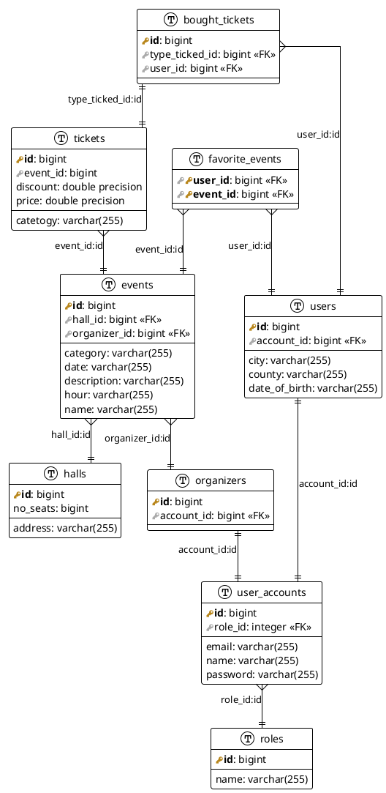

```plantuml
@startuml
!define primary_key(x) <b><color:#b8861b><&key></color>x</b>
!define foreign_key(x)<color:#aaaaaa><&key></color>x
!define table(x) entity x << (T, white) >>

!theme plain
top to bottom direction
skinparam linetype ortho

table(bought_tickets) {
   primary_key(id): bigint
   foreign_key(type_ticked_id): bigint <<FK>>
   foreign_key(user_id): bigint <<FK>>
}
table(events) {
   primary_key(id): bigint
   foreign_key(hall_id): bigint <<FK>>
   foreign_key(organizer_id): bigint <<FK>>
   category: varchar(255)
   date: varchar(255)
   description: varchar(255)
   hour: varchar(255)
   name: varchar(255)
}
table(favorite_events) {
   foreign_key(primary_key(user_id)): bigint <<FK>>
   foreign_key(primary_key(event_id)): bigint <<FK>>
}
table(halls) {
   primary_key(id): bigint
   address: varchar(255)
   no_seats: bigint
}
table(organizers) {
   primary_key(id): bigint
   foreign_key(account_id): bigint <<FK>>
}
table(roles) {
   primary_key(id): bigint
   name: varchar(255)
}
table(tickets) {
   primary_key(id): bigint
   foreign_key(event_id): bigint
   catetogy: varchar(255)
   discount: double precision
   price: double precision

}
table(user_accounts) {
   primary_key(id): bigint
   foreign_key(role_id: integer) <<FK>>
   email: varchar(255)
   name: varchar(255)
   password: varchar(255)
}
table(users) {
   primary_key(id): bigint
   foreign_key(account_id): bigint <<FK>>
   city: varchar(255)
   county: varchar(255)
   date_of_birth: varchar(255)
}
favorite_events     }--||  events                    : "event_id:id"
favorite_events     }--||   users                    : "user_id:id"
bought_tickets      ||--|| tickets                   : "type_ticked_id:id"
bought_tickets      }--||  users                     : "user_id:id"
events              }--||  halls                     : "hall_id:id"
events              }--||  organizers                : "organizer_id:id"
organizers          ||--||  user_accounts            : "account_id:id"
tickets             }--||  events                    : "event_id:id"
user_accounts       }--||  roles                     : "role_id:id"
users               ||--||  user_accounts            : "account_id:id"
@enduml
```plantuml
@startuml
!define primary_key(x) <b><color:#b8861b><&key></color>x</b>
!define foreign_key(x)<color:#aaaaaa><&key></color>x
!define table(x) entity x << (T, white) >>

!theme plain
top to bottom direction
skinparam linetype ortho

table(bought_tickets) {
   primary_key(id): bigint
   foreign_key(type_ticked_id): bigint <<FK>>
   foreign_key(user_id): bigint <<FK>>
}
table(events) {
   primary_key(id): bigint
   foreign_key(hall_id): bigint <<FK>>
   foreign_key(organizer_id): bigint <<FK>>
   category: varchar(255)
   date: varchar(255)
   description: varchar(255)
   hour: varchar(255)
   name: varchar(255)
}
table(favorite_events) {
   foreign_key(primary_key(user_id)): bigint <<FK>>
   foreign_key(primary_key(event_id)): bigint <<FK>>
}
table(halls) {
   primary_key(id): bigint
   address: varchar(255)
   no_seats: bigint
}
table(organizers) {
   primary_key(id): bigint
   foreign_key(account_id): bigint <<FK>>
}
table(roles) {
   primary_key(id): bigint
   name: varchar(255)
}
table(tickets) {
   primary_key(id): bigint
   foreign_key(event_id): bigint
   catetogy: varchar(255)
   discount: double precision
   price: double precision

}
table(user_accounts) {
   primary_key(id): bigint
   foreign_key(role_id: integer) <<FK>>
   email: varchar(255)
   name: varchar(255)
   password: varchar(255)
}
table(users) {
   primary_key(id): bigint
   foreign_key(account_id): bigint <<FK>>
   city: varchar(255)
   county: varchar(255)
   date_of_birth: varchar(255)
}
favorite_events     }--||  events                    : "event_id:id"
favorite_events     }--||   users                    : "user_id:id"
bought_tickets      ||--|| tickets                   : "type_ticked_id:id"
bought_tickets      }--||  users                     : "user_id:id"
events              }--||  halls                     : "hall_id:id"
events              }--||  organizers                : "organizer_id:id"
organizers          ||--||  user_accounts            : "account_id:id"
tickets             }--||  events                    : "event_id:id"
user_accounts       }--||  roles                     : "role_id:id"
users               ||--||  user_accounts            : "account_id:id"
@enduml
```